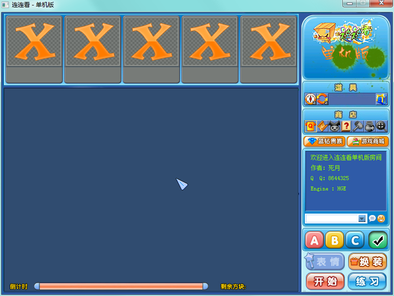
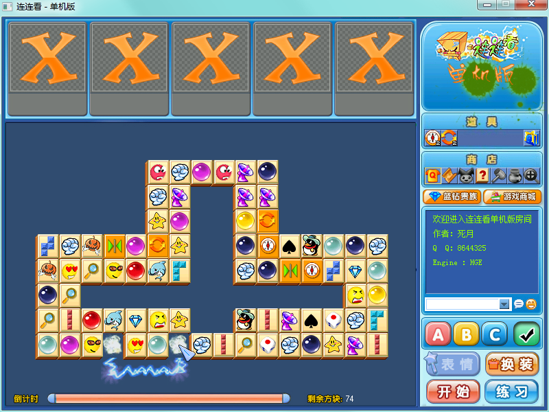
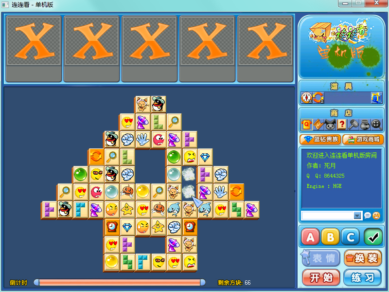

# 连连看

> 年幼无知之作，码于 2010 年 10 月初学 HGE 游戏引擎之时，为 QQ 游戏连连看的单机复刻版。其中资源版权所属为 QQ 游戏，资源仅供学习使用，不能用于商业用途。

有一个由 [Doxygen](http://www.stack.nl/~dimitri/doxygen/) 生成的文档，在该仓库的 `gh-pages` 分支，可于 [此处](http://blog.xcoder.in/lianliankan/) 访问。

## 环境需求

  * Visual Studio 2012 及其 C++ 编译器
  * 貌似也没别的什么了...
  
## 编译

  1. 在装有 Visual Studio 2012 以上的电脑上直接双击打开 [LinkMe.sln](https://github.com/XadillaX/lianliankan/blob/master/LinkMe.sln) 文件。
  2. 配置选择：
    - 若需要编译 Debug 版可执行文件则解决方案配置选择 `Debug` 版即可。
    - 若需要编译 Release 版可执行文件则解决方案配置选择 `Release`。

      > 

  3. 右键单击解决方案资源管理器栏里面的 LinkMe 项目，并点击“生成”。

      > 

  4. 等待生成完毕，这个时候会在 `Bin/` 目录下生成可执行文件。若为 Debug 版则生成的是 `连连看D.exe`，若为 Release 版则为 `连连看.exe`。
  
## 资源打包

根据业务逻辑代码，资源可选择打成三个包。

三个资源文件夹分别是 [`Bin/Maps`](https://github.com/XadillaX/lianliankan/tree/master/Bin/Maps)、[`Bin/Music`](https://github.com/XadillaX/lianliankan/tree/master/Bin/Music) 和 [`Bin/Texture`](https://github.com/XadillaX/lianliankan/tree/master/Bin/Texture)，需要分别将他们打包成三个 Zip 文件，并且指定压缩解压密码为 `X2Studio`（参考 [逻辑代码](https://github.com/XadillaX/lianliankan/blob/master/GameWorld.h#L33)）。

最后将这三个不同的 Zip 压缩包连着后缀名分别重命名为 `Maps.X2Pak`、`Music.X2Pak` 以及 `Texture.X2Pak` 即可。

## 游戏

在游戏内可无限使用两款道具：

  * 提示
  * 重排
  
分别位于游戏界面的右侧，有两个道具图标，跟 QQ 游戏一样。

## 截屏

## 贡献

本仓库仅为年幼无知作品的一个存档，理论上不再维护了，代码自己看了也觉得很初级。

但是如果你真的有意愿做些什么的话还是很欢迎的，不过我基本上没在 Windows 上写代码了。